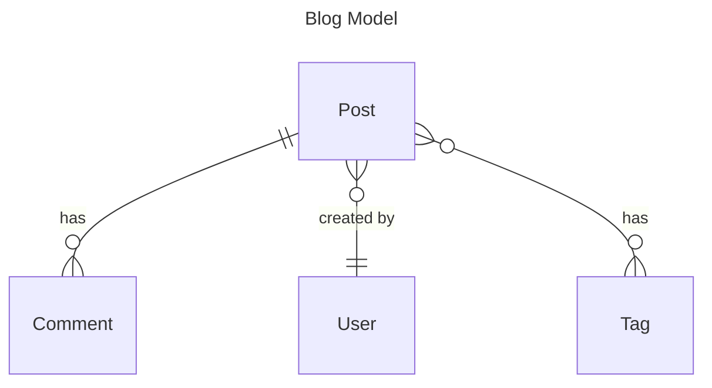

# Blog Models Kata




## Posts


```bash
python manage.py startapp posts
```

```python
# django_project/settings.py
INSTALLED_APPS = [
    # ..............
    # Local
    "accounts.apps.AccountsConfig",
    "posts.apps.PostsConfig", # new
]
```


```python
# posts/models.py
from django.conf import settings
from django.db import models


class Post(models.Model):
    title = models.CharField(max_length=50)
    body = models.TextField()
    author = models.ForeignKey(settings.AUTH_USER_MODEL, on_delete=models.CASCADE)
    created_at = models.DateTimeField(auto_now_add=True)
    updated_at = models.DateTimeField(auto_now=True)

    def __str__(self):
        return self.title
```

```bash
python manage.py makemigrations posts
python manage.py migrate
```

```python
# posts/admin.py
from django.contrib import admin

from .models import Post

admin.site.register(Post)
```

### Create a User

```bash
python manage.py shell
>>> from accounts.models import CustomUser
>>> CustomUser.objects.create(username="ivan")
<CustomUser: ivan>
```

### Add Some Posts

```bash
python manage.py shell
>>> from accounts.models import CustomUser
>>> from posts.models import Post
>>> u = CustomUser.objects.get(username="ivan")
>>> Post.objects.create(title="Hello, World!", body="It's a lovely day, isn't it?", author=u)
<Post: Hello, World!>
>>> Post.objects.create(title="Second Post", body="This is my second post.", author=u)
<Post: Second Post>
```


## Comments


```bash
python manage.py startapp comments
```

```python
# django_project/settings.py
INSTALLED_APPS = [
    # ..............
    # Local
    "accounts.apps.AccountsConfig",
    "posts.apps.PostsConfig",
    "posts.apps.CommentsConfig", # new
]
```


```python
# posts/models.py
# ....
class Comment(models.Model):
    post = models.ForeignKey(Post, on_delete=models.CASCADE, related_name="comments")
    body = models.TextField()
    author = models.ForeignKey(settings.AUTH_USER_MODEL, on_delete=models.CASCADE)
    created_at = models.DateTimeField(auto_now_add=True)
    updated_at = models.DateTimeField(auto_now=True)

    def __str__(self):
        label = truncate_with_elipsis(self.body, 50)
        return f"{self.author.username}: {label}"

```

```bash
python manage.py makemigrations posts
python manage.py migrate
```

```python
# posts/admin.py
from django.contrib import admin

from .models import Comments, Post

admin.site.register(Post)
admin.site.register(Comment)
```

### Add Some Comments

```bash
python manage.py shell
>>> from accounts.models import CustomUser
>>> from posts.models import Comment, Post
>>> u = CustomUser.objects.get(username="ivan")
>>> p = Post.objects.get(title="Second Post")
>>> Comment.objects.create(body="comment 1", author=u,post=p)
<Comment: ivan=comment 1>
```

## Tags

```python
# posts/models.py
# ....

class Post(models.Model):
    title = models.CharField(max_length=50)
    body = models.TextField()
    author = models.ForeignKey(settings.AUTH_USER_MODEL, on_delete=models.CASCADE)
    tags = models.ManyToManyField('Tag', related_name='posts', through='PostTag')  # new
    created_at = models.DateTimeField(auto_now_add=True)
    updated_at = models.DateTimeField(auto_now=True)

    def __str__(self):
        return self.title

# .......

class Tag(models.Model):
    name = models.CharField(max_length=30, unique=True)

    def __str__(self):
        return self.name

class PostTag(models.Model):
    post = models.ForeignKey(Post, on_delete=models.CASCADE)
    tag = models.ForeignKey(Tag, on_delete=models.CASCADE)

    class Meta:
        unique_together = ('post', 'tag')

```

The relationship between Post and Tag could be specified also without link table. In this case Django will automatically create a link table:

```python
tags = models.ManyToManyField('Tag', related_name='posts')
```


```python
# posts/admin.py
from django.contrib import admin

from .models import Comments, Post

admin.site.register(Post)
admin.site.register(Comment)
admin.site.register(Tag) # new
admin.site.register(PostTag) # new
```

```bash
python manage.py makemigrations posts
python manage.py migrate
```

### Assign Tags to a Post

```bash
python manage.py shell
>>> from posts.models import Post, Tag
>>> t1 = Tag.objects.create(name="Tag 1")
>>> t2 = Tag.objects.create(name="Tag 2")
>>> p = Post.objects.get(title="Second Post")
>>> # Tags can be assigned by instance reference
>>> p.tags.set([t1, t2])
>>> p.tags.all()
<QuerySet [<Tag: Tag 1>, <Tag: Tag 2>]>
>>> # Tags can be assigned by ID
>>> p.tags.set([t1.id])
<QuerySet [<Tag: Tag 1>]>
>>> # Attempt to assign a tag multiple times is assigning it only once
>>> p.tags.set([t1, t1]) 
>>> p.tags.set([t1.id])
<QuerySet [<Tag: Tag 1>]>
```
